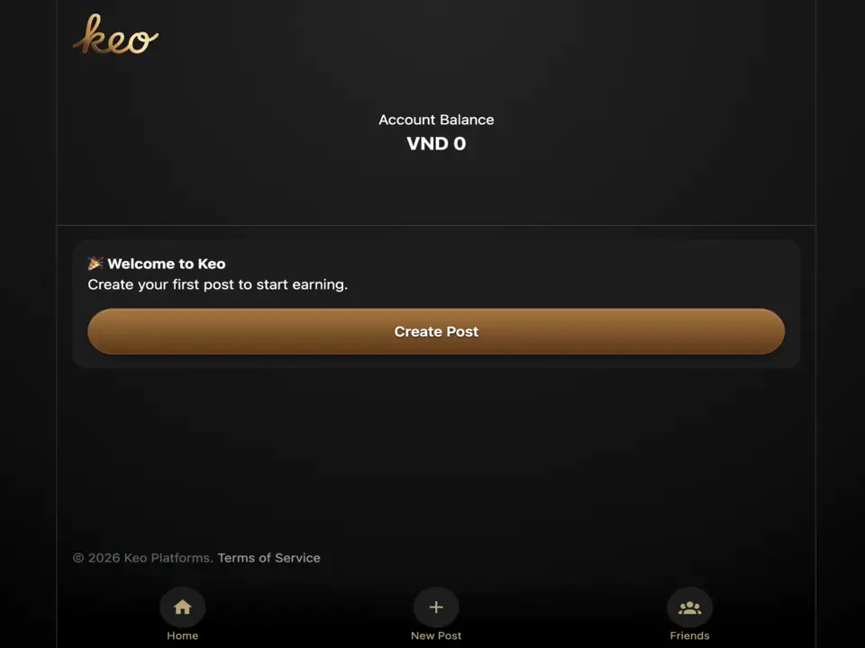

# Inertia X UI

> **DEPRECATION NOTICE**
>
> Inertia X UI 1.0 is deprecated and unsupported. The party continues on the [2.x branch](https://github.com/buhrmi/inertiax-ui/tree/2.x).

A collection of Svelte components for [Inertia X](https://github.com/buhrmi/inertiax).

Demo: https://inertiax-ui.netlify.app

## Modal

The Modal component displays an [Inertia X Frame](https://github.com/buhrmi/inertiax#frame-component) within a modal. The preview below shows the default dark theme, which renders as a bottom sheet on mobile and centered on desktop. See below for styling options



### Creating a modal

You can programmatically create a Modal using the `createModal(props)` function. All passed props are handed down to the Frame component, in addition to a `close` function (see below). 

```js
import { createModal } from 'inertiax-ui'

const modal = createModal({
  src: '/profile/edit'
})
```

`createModal` returns a `close` function you can call to close the modal programmatically. Call `close()` or `close(true)` to navigate back in history then unmount. Call `close(false)` to unmount without touching history:

```js
const closeModal = createModal({ src: '/profile/edit' })

// Navigate back, then unmount
closeModal()

// Or just unmount, skip history
closeModal(false)
```

#### `modal` action

Inertia X UI also ships with a `modal` action. This is a small wrapper for `createModal` and passes the `href` attribute as the `src` prop.

```svelte
<script>
  import { modal } from 'inertiax-ui'
</script>

<a href="/profile/edit" use:modal>Edit profile</a>
```

You can also pass options like `onclose`:

```svelte
<script>
  import { modal } from 'inertiax-ui'
  import { router } from 'inertiax-svelte'
</script>

<a href="/profile/edit" use:modal={{ onclose: () => router.reload() }}>Edit profile</a>
```

### Closing a modal

The Modal component passes a `close` function down to its page component as a prop. You can call this function to close it. Behind the scenes, calling `close` will use the browsers Navigation API to traverse the history back to before the modal was opened, which in turn triggers callbacks that unmount the modal. Alternatively, you can call `close(false)` to close the modal without going back in history. This will prevent forward-navigation from re-opening the modal.

```svelte
<script>
  const { close } = $props()
</script>

<button onclick={close}>Close</button>
```

Note that `createModal` also returns a `close` function you can call to close the modal programmatically from the parent.


### `onclose` callback

Pass an `onclose` callback to run custom logic when the modal closes. This fires regardless of how the modal was closed — via the close button, backdrop click, or browser back button.

```js
import { createModal } from 'inertiax-ui'
import { router } from 'inertiax-svelte'

createModal({
  src: '/profile/edit',
  onclose: () => router.reload()
})
```

Common use cases: reloading the parent page after an edit, resetting form state, or cleaning up side effects.

### `animateHeight`

By default, the modal smoothly animates its height whenever the content changes (e.g., navigating between pages inside the modal). Set `animateHeight: false` to disable this behavior and let the modal resize instantly.

```js
createModal({
  src: '/profile/edit',
  animateHeight: false
})
```

### Communicating with the parent

All props passed to `createModal` (except `src`) are forwarded to the page component rendered inside the modal. This lets you pass callbacks that the modal page can call to communicate back to the parent.

```js
// In your parent component
import { createModal } from 'inertiax-ui'

createModal({
  src: '/profile/edit',
  onSave: (data) => {
    console.log('Saved:', data)
  }
})
```

```svelte
<!-- Inside the modal page (e.g. /profile/edit) -->
<script>
  const { onSave, close } = $props()

  let name = $state('')
</script>

<button onclick={() => { onSave({ name }); close() }}>Save</button>
```

```js
// Also works with the modal action
<a href="/profile/edit" use:modal={{ onSave: (data) => handleSave(data) }}>Edit</a>
```

## Installation

To start using Inertia X UI, install the `inertiax-ui` package and import the CSS style you'd like to use.

### Styling

Inertia X UI ships with `modal.css` which automatically adapts to the system color scheme preference. You can override this by setting the `[data-theme]` attribute on `html` or `body`:

```js
import 'inertiax-ui/modal.css'
```

To force a theme:

```js
// Force dark theme
document.documentElement.setAttribute('data-theme', 'dark')

// Force light theme
document.documentElement.setAttribute('data-theme', 'light')
```

For full styling control, you can of course bring your own CSS. The key classes to target are:

| Class | Element |
|-------|---------|
| `.inx-modal_wrapper` | Full-screen overlay container |
| `.inx-modal_bg` | Clickable backdrop |
| `.inx-modal` | The modal panel itself |
| `.inx-spinner` | The loading animation spinner |

Additionally, Svelte injects a `--progress` variable with the current progress of the modal in- and out-transition (0 to 1). You can use it to create your own in- and out-transitions.
